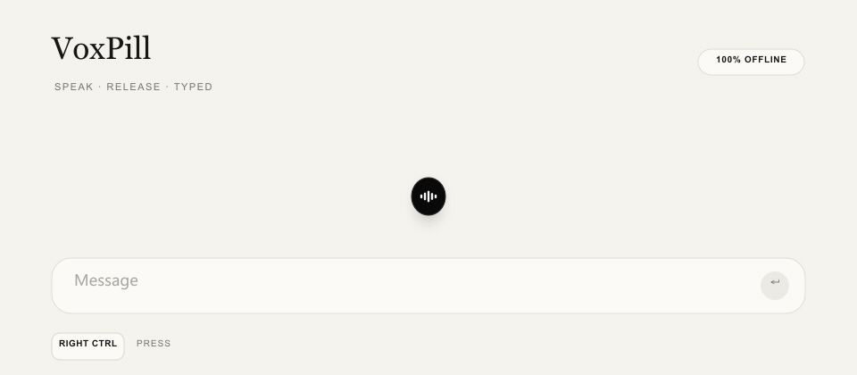

<p align="center">
  <picture>
    <source media="(prefers-color-scheme: dark)" srcset="docs/assets/voxpill-icon-dark.svg">
    <source media="(prefers-color-scheme: light)" srcset="docs/assets/voxpill-icon-light.svg">
    
  </picture>
</p>

<h1 align="center">VoxPill</h1>

<p align="center">
  
</p>

**Speak. Release. Typed.**

VoxPill is a lightweight, fully offline push-to-talk typing tool for Windows.
Hold **Right Ctrl**, speak, then release the key to insert the final text into
the window you started from. A compact native pill displays a pseudo-streaming
preview without stealing focus.

## Highlights

- **CPU-only recognition** — one static INT8 Paraformer pipeline; no discrete GPU, CUDA, or Torch.
- **Offline by design** — audio never leaves your computer.
- **Pseudo-streaming preview** — accumulated audio is adaptively re-decoded while you speak, then each new hypothesis is revealed character by character.
- **One-model consistency** — preview and final use the same recognizer and punctuation model.
- **Type anywhere** — chat boxes, documents, browsers, editors, and other Windows apps.
- **Focus-safe commit** — the final text returns to the window active when recording began.
- **Native 60 Hz overlay** — per-pixel alpha, no focus stealing, light/dark auto theme.

## Demo

<p align="center">
  
</p>

## Quick start

Requirements: Windows 10/11 x64, Python 3.11+, a microphone, and
[uv](https://docs.astral.sh/uv/getting-started/installation/).

```powershell
git clone https://github.com/gaivrt/voxpill.git
cd voxpill

$env:UV_PROJECT_ENVIRONMENT = ".venv-win"
uv sync
uv run python bench\download_models.py current_paraformer punctuation
uv run python -u main.py
```

After setup, `start-voicekey.bat` provides a convenient launcher. The model
download is roughly 320 MiB; weights are intentionally not stored in Git.

## Start with Windows

First confirm that `start-voicekey-hidden.vbs` launches VoxPill correctly. Then
press **Win+R**, enter `shell:startup`, and create a shortcut to that VBS file
inside the Startup folder. Create a shortcut to the original file rather than
copying it, because the script locates `start-voicekey.bat` relative to itself.

```powershell
$project = (Get-Location).Path
$startup = [Environment]::GetFolderPath("Startup")
$shell = New-Object -ComObject WScript.Shell
$link = $shell.CreateShortcut((Join-Path $startup "VoxPill.lnk"))
$link.TargetPath = "$env:SystemRoot\System32\wscript.exe"
$link.Arguments = '"' + (Join-Path $project "start-voicekey-hidden.vbs") + '"'
$link.WorkingDirectory = $project
$link.Description = "VoxPill offline voice typing"
$link.Save()
```

To disable startup, delete only `VoxPill.lnk` from `shell:startup`.

## Use

```text
Hold Right Ctrl  → recording starts and the live transcript appears
Release          → the full recording is recognized and inserted once
```

VoxPill types text by default; it does not press Enter or send the message.
Recordings shorter than 0.3 seconds are ignored. A mouse guard filters brief
modifier pulses emitted by some mouse drivers.

中文：按住右 Ctrl 说话，松开后文字会自动写入开始录音时的窗口。默认不会自动回车发送。

## Configuration

Edit `config.toml`, then restart VoxPill:

```toml
[hotkey]
key = "ctrl_r"

[overlay]
theme = "auto"  # auto / light / dark

[behavior]
inject_method = "paste"      # paste / unicode
restore_clipboard = false
auto_enter = false
min_seconds = 0.3

[recognition]
preview_interval_seconds = 1.0
preview_max_interval_seconds = 2.0
preview_min_seconds = 0.8
preview_max_audio_seconds = 30.0
max_audio_seconds = 120.0

[audio]
device = ""                  # empty = Windows default input device
```

Supported single-key hotkeys include left/right Ctrl, Alt, Shift, the grave key,
and F1–F12.

## Models

| Component | Purpose | Approx. size |
|---|---|---:|
| Static INT8 Paraformer | Chinese/English preview and final | 232 MiB |
| INT8 CT-Transformer | Chinese/English punctuation | 72 MiB |

Sources, exact sizes, and SHA-256 values are documented in
[`models/README.md`](models/README.md). The downloader prefers the configured
Hugging Face mirror; pass `--origin` for the canonical source.

## Portable build

Download the models, then run:

```powershell
.\build-portable.bat
```

The self-contained CPU-only application is created at
`dist\VoxPill\VoxPill.exe`.

## Architecture

```text
Right Ctrl gate
  → PortAudio callback queues 16 kHz mono PCM
  → capture worker appends to a bounded buffer
  → one static Paraformer adaptively re-decodes accumulated audio
  → native no-activate overlay renders previews
  → key release stops preview scheduling and publication
  → the same Paraformer recognizes the full recording with final priority
  → original target window is restored
  → text is inserted once
```

Audio callbacks only copy PCM. One priority gate serializes recognition; a
waiting final passes any waiting preview, while a release/session lock prevents
late preview text from appearing. The overlay owns a separate Win32 UI thread
and 60 Hz ticker.

## Development

```powershell
$env:UV_PROJECT_ENVIRONMENT = ".venv-win"
uv run python -m unittest discover -s bench\tests -v
```

The personal-corpus benchmark records CER, WER, MER, RTF, load time, and peak
working set. Recordings, weights, results, environments, logs, and builds are
excluded from Git.

On the development Windows machine, the fixed static baseline measured CER
10.60%, WER 20.83%, MER 28.79%, corpus RTF 0.035, about 1.16 seconds load time,
and about 363 MiB peak model-process working set. These are reference values,
not hardware-independent guarantees.

After 14 successful microphone sessions, the full Windows App stabilized at
about 500.3 MiB working set, within its 512 MiB steady-state budget. VoxPill
does not force-trim memory at the cost of the next utterance's latency.

## Acknowledgements

VoxPill is built on [`sherpa-onnx`](https://github.com/k2-fsa/sherpa-onnx) and
the quantized Paraformer and CT-Transformer models listed in
[`models/README.md`](models/README.md).

## Friends

- [LINUX DO](https://linux.do/) — Where possible begins.
